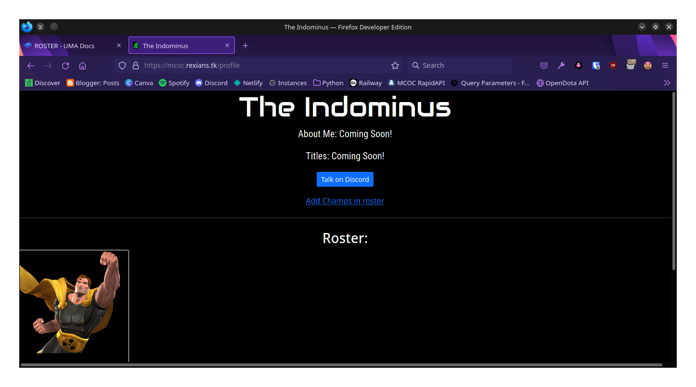

# ROSTER(New)

Roster is a new feature and cannot be controlled from only the API. So, A new method has been made for working with the roster.&#x20;

The Rexians website has a cool new feature which can be accessed from [**here**](https://mcoc.rexians.tk/login).&#x20;

The User has to login by clicking on the button:

.png>)

After that, You will be redirected to the Discord Authentication Page:

.png>)

Click on the Authorize Button which will therefore take you to the Gamename adder page! Write your gamename (Note: Make sure it is correct because you will never be able to change it again) and proceed further.

You will be atlast redirected to your Profile Page where you can add champs and see your existing added champs:

Your data will be successfully added to our Database and users who have a account, their data will be visible to be used in the API. The data then can also be accessed from the following route(s) to work with which is shown further.
